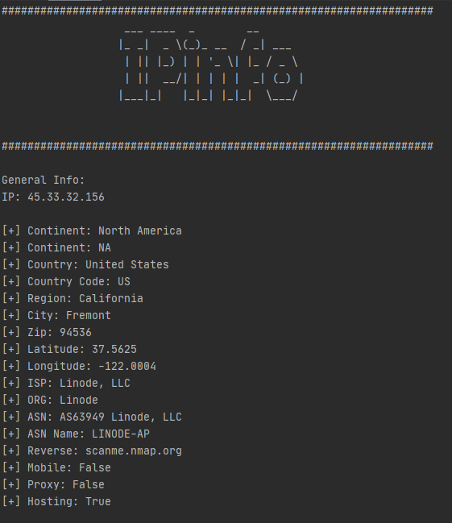
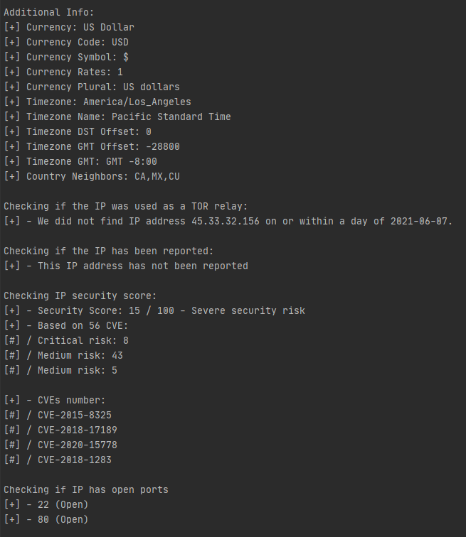
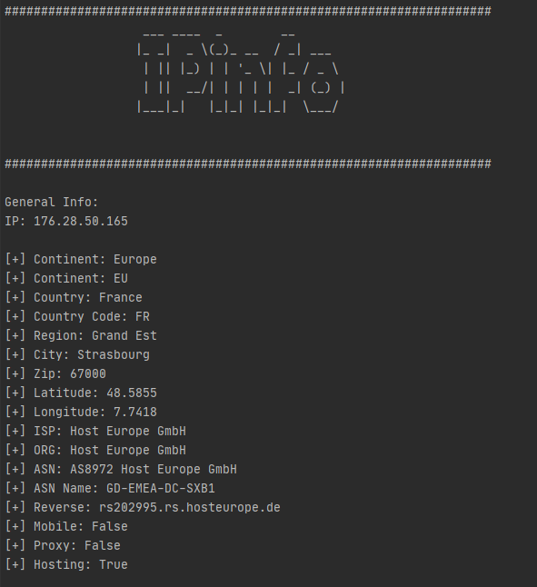
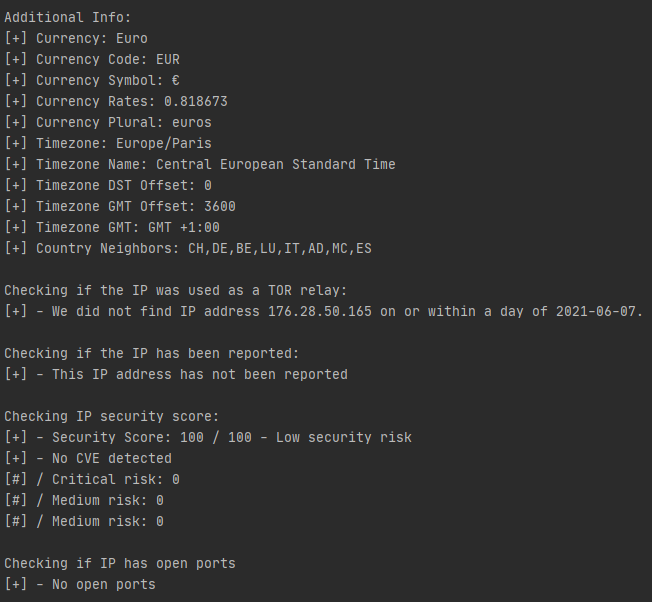

# IPinfo

IPinfo is a python program that give us information about a given IP address (Geolocation, Open ports, CVEs). 

## Usage

```python ipinfo.py [-h] -i IP```

Example 1 (IP used - 45.33.32.156 - http://scanme.nmap.org/):




Example 2(IP used - 176.28.50.165 - http://testphp.vulnweb.com/):




## Requeriments

- appdirs==1.4.4
- beautifulsoup4==4.9.3
- bs4==0.0.1
- certifi==2021.5.30
- chardet==4.0.0
- cssselect==1.1.0
- fake-useragent==0.1.11
- idna==2.10
- lxml==4.6.3
- parse==1.19.0
- pyee==8.1.0
- pyfiglet==0.8.post1
- pyppeteer==0.2.5
- pyquery==1.4.3
- requests==2.25.1
- requests-html==0.10.0
- six==1.16.0
- soupsieve==2.2.1
- tqdm==4.61.0
- urllib3==1.26.5
- w3lib==1.22.0
- websockets==8.1

## Resources
- https://spyse.com/
- https://www.abuseipdb.com/
- https://metrics.torproject.org/
- https://ipwhois.app/
- http://ip-api.com/
